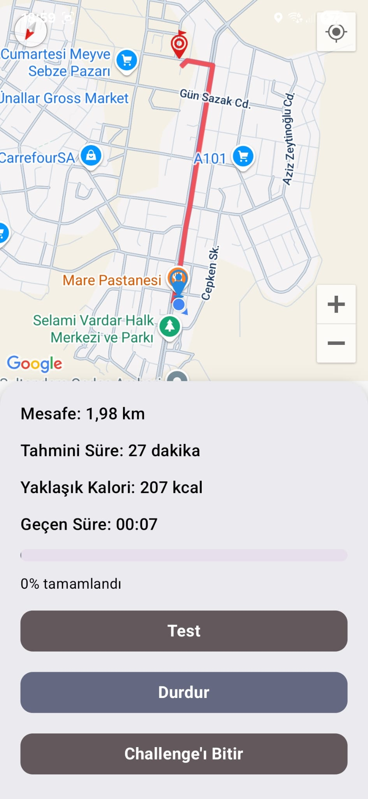
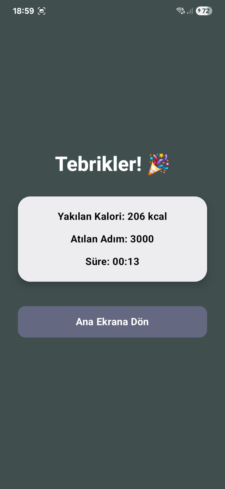
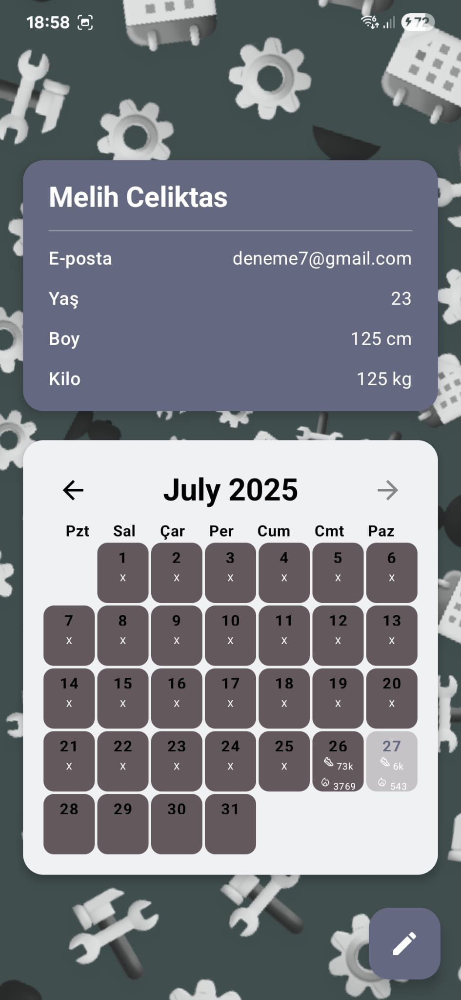
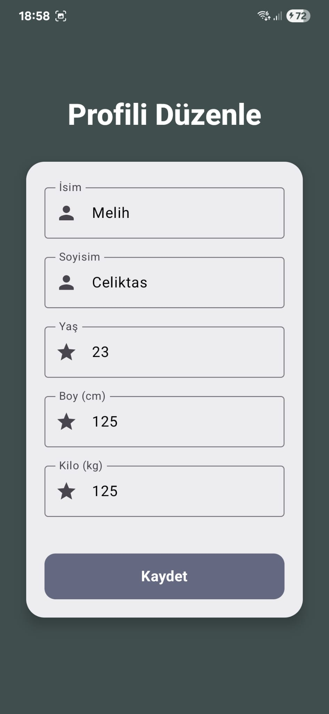
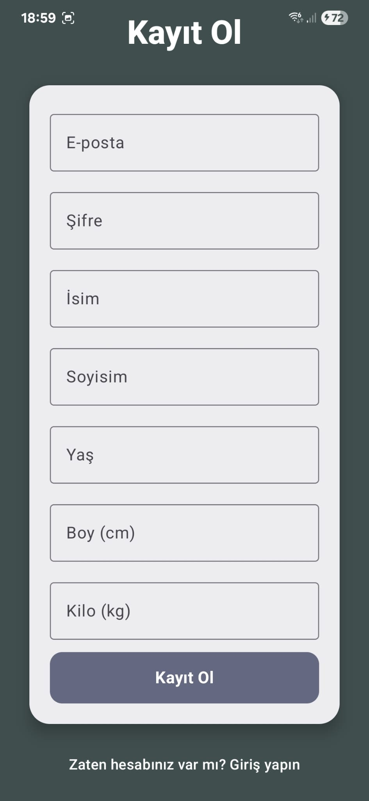

# Walk2Lose 🚶‍♂️🔥
Walk2Lose – Native Android Fitness App (demo, screenshots, overview)

**Walk2Lose** is a native Android fitness app that generates randomized walking challenges based on user-defined steps.  
It utilizes Google Maps API to select target locations and guides the user through a full route.

> ❗ Source code is not included in this repository.  
> This repository serves as a showcase for academic and portfolio purposes only.

## 🧠 Features
- Step-based randomized route generation
- Google Maps integration
- Real-time distance tracking
- Calorie estimation
- Firebase user authentication
- User profile and daily stats

## 📸 Screenshots

## 👤 Developer
Melih Çeliktaş  
[LinkedIn](https://www.linkedin.com/in/melih-%C3%A7elikta%C5%9F-77880218a/)

© 2025 Melih Çeliktaş. All rights reserved.
